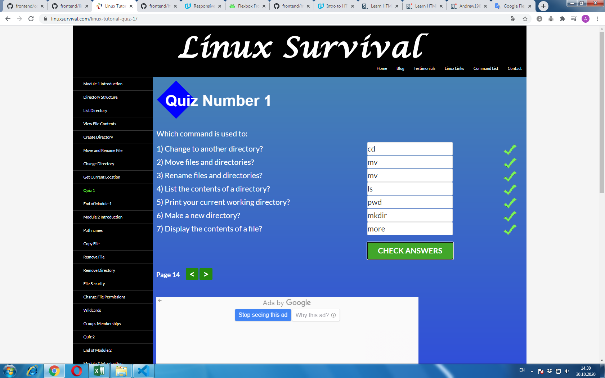

# kottans-frontend

My impressions about learned materials are really good, especially Version Control with Git. 
Everything is well understood, especially how to use Git in real practice.
On the other hand learngitbranching.js.org not so clear for me to undarstand, especially how it use
correct in practice.

## Linux CLI, and HTTP

My reflections on all Linux CLI, and HTTP subtasks.

Linux CLI module_1, module_2 weren\`t new for me, I\`d learned those material earlier, just repeat.

Module_3, Module_4 were new for me. The information is presented clearly and hope that I will use this knowledge. 

Articles about HTTP protocol were really hard to clear understanding in details and I hope to sort out with all that info later. Although main 
understanding of HTTP Basics, Tools to View HTTP Traffic, Using HTTP in Web Frameworks and Libraries, HTTP connections, Identification and Authentication is present.

I hope to use this useful information in my future professional activity, especial Linux CLI, Web Developers Tools, Identification and Authentication.

## Git Collaboration

In this third part of General level about GitHub and Collabotation new for me were almost all information.
Like in zero Git Basics part GitHub & Collaboration from Udacity is well understood, but not learngitbranching.js.org.
So to work and collaborate with other developers through Git and GitHub I\`m going to study some extra materials.
 
## Intro to HTML and CSS

Good intro to Web development! Practice, practice and one more time practice and everything will be allright!
A lot of new information for me, especially CSS Flex and pure Grid (without Bootstrap library). Despite I\`ve learned HTML and CSS earlier, I\`ve got new extra
knowledge, that I intend to use in future.

## Responsive Web Design

Good intro to Responsive Web Design, theory and some practice it\`s a fine combination in studying!
I\`ve repeated and refreshed some information about responsiveness in WEB Development and learned some other. Namely,
more clearly understanding how to apply Flexbox tools, Responsive patterns and other optimizations, like 
responsive images, tables and minor breakpoints.

## HTML & CSS practice: Hooli-style Popup

[Demo](https://andriizahumnyi.github.io/HTML-CSS-practice-Hooli-style-Popup/)

In this practice task I\`ve faced with web accessibility, that was brand new for me!
It was really interesting challenge, to implement ability to switch across all the interactive
elements using only keyboard (without a mouse) with CSS pseudo-class :focus.
Also was very interesting to realize this Popup menu without JavaScript, only pure HTML & CSS.

## JS Basics

In this section I\`ve repeated JavaScript Basics and learned intro to ES6 Standard. Almost all ES6 standard was new for me,
except let, const and a little bit about arrow functions, Default Parameters for FunctionsPassed, Create Strings using Template Literals and some other.

Interesting part was Functional programming that an approach to software development based around the evaluation of functions.
I have got more clear understanding and possibility to use Map, Reduce, Filter, Some, Every, ForEach and some other arrays methods in solving tasks.
Really surprised me Filter, Map, especially Reduce array method, so powerfull! But I need more practice to use them more widely and more easy to solving tasks.
Also new was Concat method, I`ve learned difference between Slice and Splice methods.

Brand new for me in ES6 standard were:
- Object.freeze() function,
- Use the Rest Parameter with Function ParametersPassed,
- Use the Spread Operator to Evaluate Arrays In-Place,
- Use Destructuring Assignment to Extract Values, Assign Variables,
- Write Concise Object Literal Declarations Using Object Property Shorthand,
- Write Concise Declarative Functions with ES6.

I intend to use all these knowledge in my future professional activity!

## DOM

