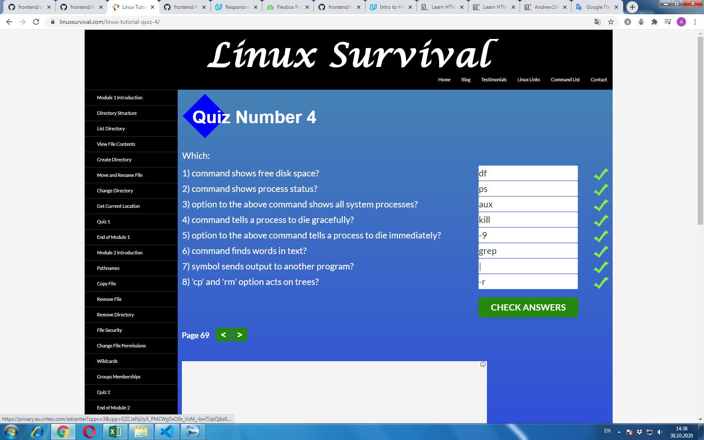
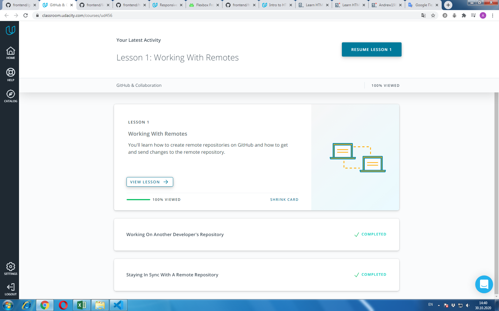

# kottans-frontend

Udacity really interesting materials. Thanks!

## Linux CLI, and HTTP

My reflections on all Linux CLI, and HTTP subtasks.

Linux CLI module_1, module_2 weren`t new for me, I`ve learned them earlier. 
I`ve just repetead:
- In Module_1 how to change to another directory; move, rename files and directories; list the contents of a directory;
print my current working directory; make a new directory; display the contents of a file.
- In Module_2 how to copy files; remove files; list the groups I am in; remove empty directories; change file permissions. Also I`ve learned
about representing all files '*', all other users 'o'; executive permission 'x'.

Module_3, module_4 were new for me. I hope to use this useful information in my future professional activity.

Articles about HTTP protocol were really hard to clear understanding in details and I hope to sort out with all that info later. Although main 
understanding of HTTP Basics, Tools to View HTTP Traffic, Using HTTP in Web Frameworks and Libraries, HTTP connections, Identification and Authentication is present.

I hope to use this useful information in my future professional activity, especial Linux CLI, Web Developers Tools, Identification and Authentication.

## Git Collaboration

