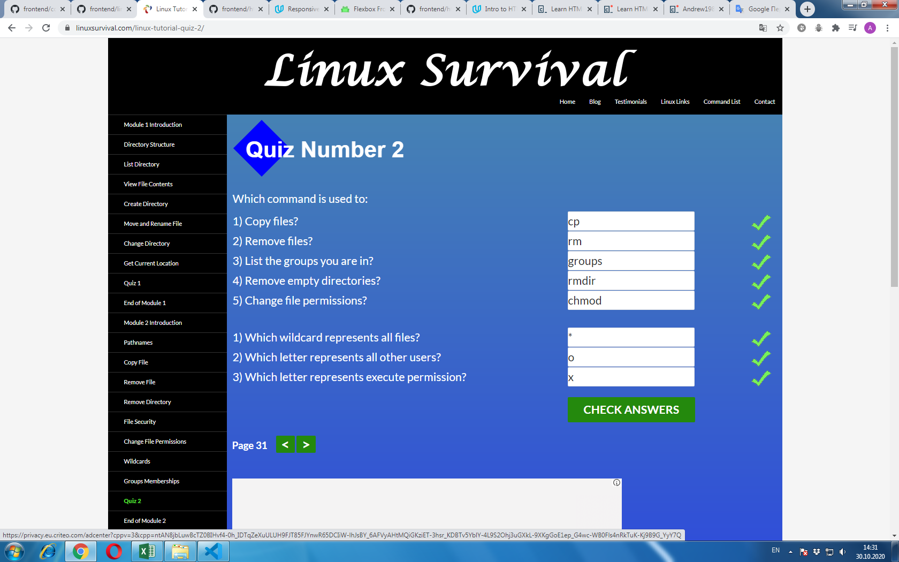

# kottans-frontend

My impressions about learned materials are really good, especially Version Control with Git. 
Everything is well understood, especially how to use Git in real practice.
On the other hand learngitbranching.js.org not so clear for me to undarstand, especially how it use
correct in practice.

## Linux CLI, and HTTP

My reflections on all Linux CLI, and HTTP subtasks.

Linux CLI module_1, module_2 weren`t new for me, I`d learned those material earlier, just repeat.

Module_3, Module_4 were new for me. The information is presented clearly and hope that I will use this knowledge. 

Articles about HTTP protocol were really hard to clear understanding in details and I hope to sort out with all that info later. Although main 
understanding of HTTP Basics, Tools to View HTTP Traffic, Using HTTP in Web Frameworks and Libraries, HTTP connections, Identification and Authentication is present.

I hope to use this useful information in my future professional activity, especial Linux CLI, Web Developers Tools, Identification and Authentication.

## Git Collaboration

In this third part of General level about GitHub and Collabotation new for me were almost all information.
Like in zero Git Basics part GitHub & Collaboration from Udacity is well understood, but not learngitbranching.js.org.
So to work and collaborate with other developers through Git and GitHub I`m going to study some extra materials.
 
## Intro to HTML and CSS

